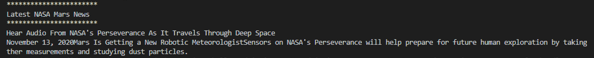
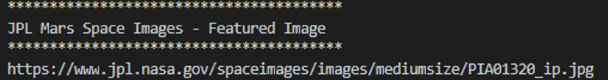
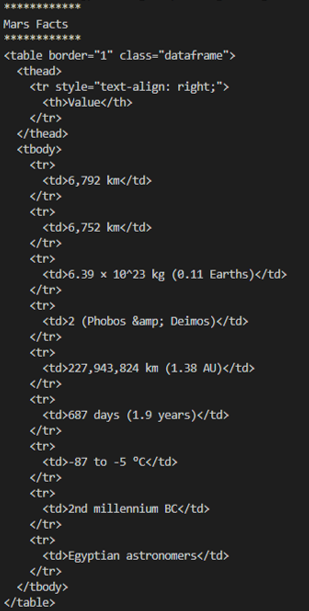
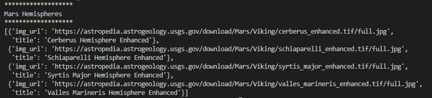
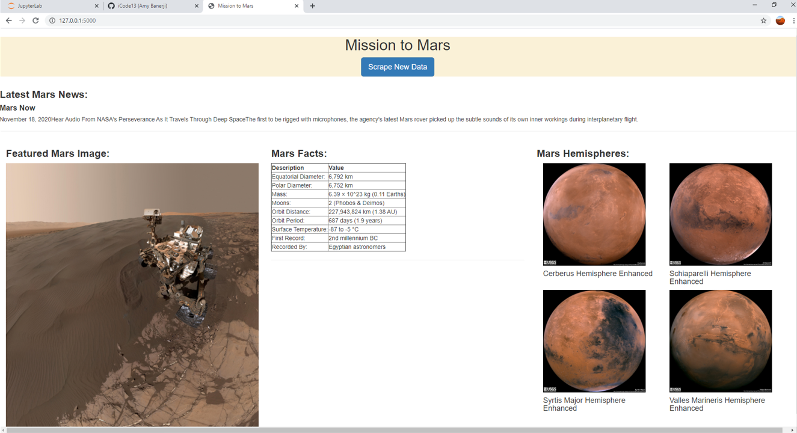
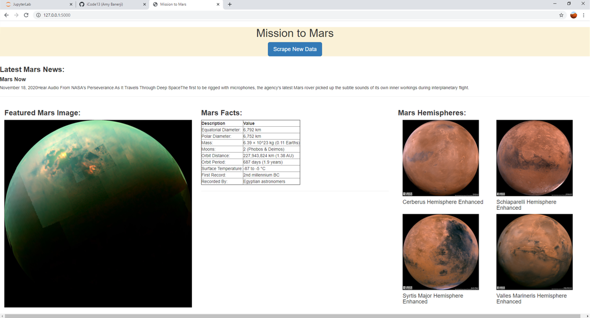
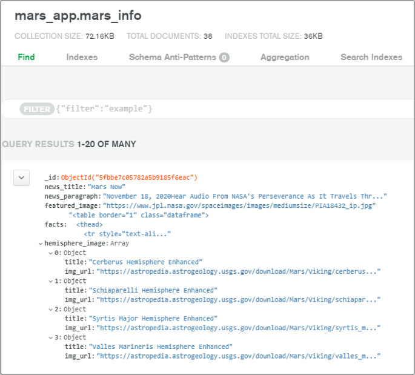

# Web Scraping Challenge - Mission to Mars

## General Info
In this project, a web application was built that scrapes various websites for data related to the Mission to Mars and displays the information in a single HTML page.

## Screenshots of Scraped Data and Final Application
##### Scraped latest NASA news title and paragraph:

##### Scraped JPL featured Mars image link:

##### Scraped Mars facts as HTML table:

##### Scraped Mars hemisphere image urls and titles as a dictionary:

##### First screenshot of final application page:

##### Second screenshot of final application page:

##### Screenshot of MongoDB query:

## Technologies
    python - version 3.7
    selenium - version 3.151.0
    beautifulsoup4 - version 0.0.1 
    pandas - version 1.1.4
    pymongo - version 3.11.1
    flask - version 1.1.2
    Jinja
    HTML
    MongoDB Atlas
    geckodriver
    Visual Studio Code 1.51.1

## Contact
Created by [@iCode13](https://github.com/iCode13) - please feel free to contact me with questions.
